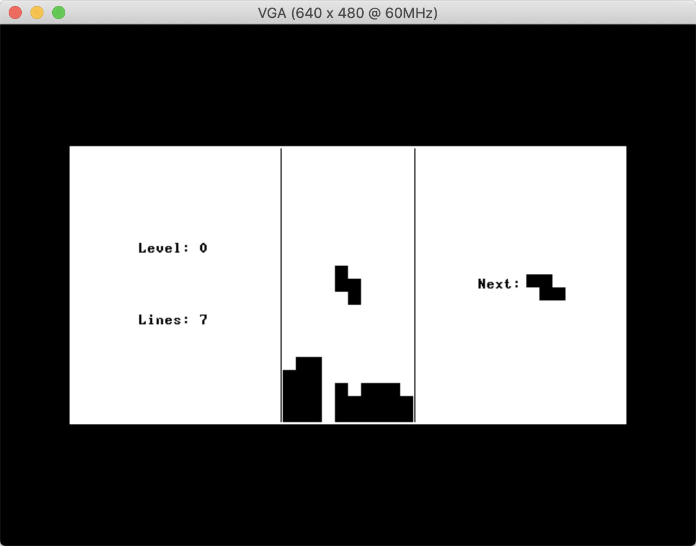

# Tetris.Jack
This is an implementation of a Tetris-like game in the Jack programming language, designed to be run on the “Hack” computer architecture as set out in the book [_The Elements of Computing Systems_](https://mitpress.mit.edu/books/elements-computing-systems).

## Installation

Most Jack compilers should be able to deal with this project; however it has been developed and tested using the [Jackc compiler](https://github.com/leocassarani/jackc).

If Jackc is present on your system, then you can simply run `make Tetris.bin` or `make Tetris.hack` depending on the desired output format.

## Limitations

The biggest enemy of writing a reasonably complex Jack application is the built-in limit on the file size of the resulting binary. Hack instructions are addressed using 15 bits, which gives us a maximum of 2^15 = 32,768 instructions.

The current version of Tetris is compiled down to 32,654 instructions, which is just over 100 instructions below the limit. However, this has been achieved by optimising some of the code for binary size rather than performance and, more importantly, by aggressively pruning the so-called OS libraries provided by the Nand to Tetris course.

For example, hardly any of the drawing functions in `Screen.vm` have survived. Instead, all drawing is done by directly accessing the memory-mapped screen, as can be seen for example in the `Grid.jack` file. Similarly, most OS functions that are unused by the Tetris game have had to be removed in order to stay within the limit.

## Randomness

A big part of a game of Tetris is the unpredictability of the next tetromino, leading to a unique sequence of pieces for each game. Unfortunately, however, the Hack platform doesn’t support random number generation.

To give the feeling of randomness, then, a very simple pseudo-random number generator (PRNG) has been implemented in the `Random.jack` file. This PRNG uses the timing and key codes of the user’s keyboard presses to continuously seed an algorithm that applies a series of XOR operations and is guaranteed to produce all possible 256 8-bit values.

Although by no means perfect, the resulting algorithm would appear to be good enough in most circumstances, especially given the very limited mathematical operations available on the Hack platform, and the need to calculate the next tetromino in a relatively small number of instructions.
